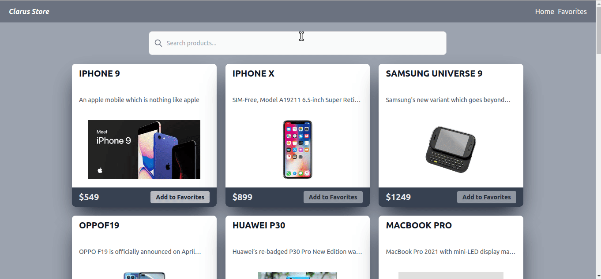

<p>Clarusway</p>

# Tech Store

## Project Skeleton

```
Tech Store with Typescript+Tailwindcss+Redux-Toolkit

SOLUTION
├── src
│    ├── index.css
│    ├── index.tsx
│    ├── App.tsx
│    ├── app
│    │   ├── hooks.ts
│    │   └── store.ts
│    ├── components
│    │   ├── Card.tsx
│    │   ├── Navbar.tsx
│    │   └── SearchComp.tsx
│    ├── features
│    │   └── productsSlice.ts
│    ├── models
│    │   └── models.ts
│    ├── pages
│    │   ├── FavoritesPage.tsx
│    │   └── Home.tsx
│    └── react-app-env.d.ts
├── package.json
├── README.md
├── tailwind.config.js
├── tsconfig.json
└── yarn.lock
```

## Expected Outcome




### At the end of the project, following topics are to be covered;

- HTML

- CSS

- JS
- TS
- React

